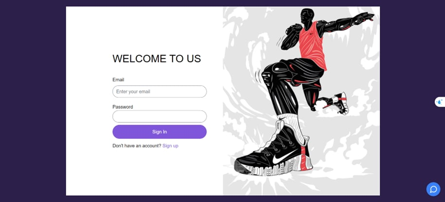
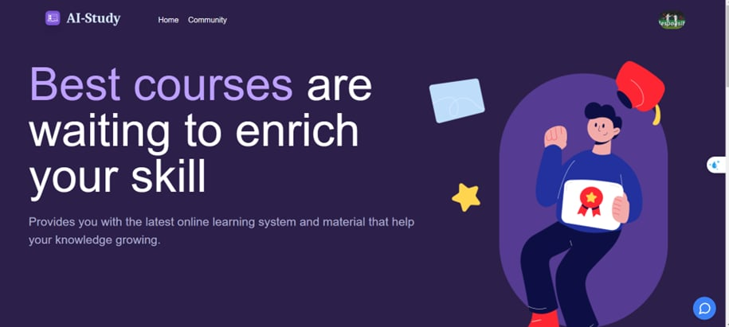
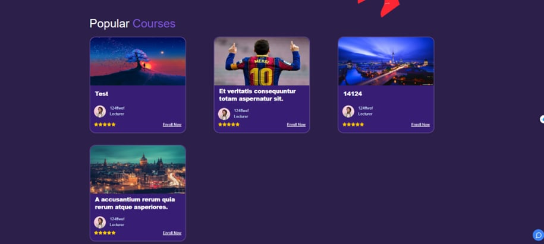

# INFORMATION TECHNOLOGY 2 PROJECT

PROJECT : **INFORMATION TECHNOLOGY 2 PROJECT**

MENTOR: [**Dương Hữu Phúc**][dhp]

MEMBER:

-   Phạm Nguyễn Hoàng Quân - 51900419
-   Nguyễn Đức Dũng - 51900732

## INTRODUCTION

-   Subject: **INTELLITEACH HUB: LEARNING PLATFORM LINKED TO AI AND FORUM**
    The Learning Management System (LMS) integrated with Artificial
    Intelligence (AI) is a fusion of two frameworks: NestJS for the backend and VueJS
    for the frontend.
    NestJS provides a robust foundation with its module-based
    architecture and dependency injection, while VueJS delivers a flexible and user-
    friendly interface with its component-based syntax. By combining these frameworks,
    the LMS system coupled with AI can offer personalized and efficient learning
    v
    experiences, leveraging data analysis, content recommendations, and customized user
    experiences

## MAIN ACTION

-   Login/ Logout
-   User management
-   Course management
-   Category management
-   Blog management
-   Payment
-   Quiz management

## 🔗Link demo

<a  margin=5 href="https://restaurant-management-fe.vercel.app/" target="blank">
    
</a>

## 📷Screenshot

### 🔥Dashboard

<div align="center" style="margin-bottom: 4rem">
    
</div>

### 🔥Login

<div align="center" style="margin-bottom: 4rem">
    
</div>

### 🔥HomePage

<div align="center" style="margin-bottom: 4rem">
    
</div>

### 🔥Course

<div align="center" style="margin-bottom: 4rem">
    
</div>

## Technology used

API BACK-END:

-   [Nest.js](https://nestjs.com/) - A progressive Node.js framework for building efficient, reliable and scalable server-side applications.
-   [Stripe](https://stripe.com/) - Stripe powers online and in-person payment processing and financial solutions for businesses of all sizes.
-   [Flowise](https://flowiseai.com/) - Open source low-code tool for developers to build customized LLM orchestration flow & AI agents
-   [Docker] - Bidirectional and low-latency communication for every platform

FRONT END:

-   [VueJS] - HTML enhanced for web apps!

Database : [MySQL](https://www.mysql.com/)

## 🐳 Docker

### Docker Compose

1. Go to `docker` folder at the root of the project
2. Type some configuration to match with your config to `.env.example` file and rename to `.env`
3. `docker-compose up -d`
4. Open [http://localhost:80] to see lms website and open (http://localhost:81) to see blog community
5. You can bring the containers down by `docker-compose stop`

## Configuation

Minimum requirements [Node.js](https://nodejs.org/) v10+

Install the necessary library packages for the Back-end:

```sh
cd backend
yarn
```

Install the necessary library packages for the front-end:

```sh
cd frontend/lms-fe
npm install
```

```sh
cd frontend/lms-blog-fe
npm install
```

Configure environment variables for Front-end:

-   **VUE_APP_API_BASE_URL**: The server's default address.

Configure environment variables for Back-end:

-   **PORT**: port của server.
-   **HOST**: host của server mặc định là localhost.
-   **PORT_CLIENT**: port front end.
-   **DB_URL**: địa chỉ url của mongodb docker (ex: mongodb://mongo_container:27017/SOA_Midterm).
-   **ADMIN_PASSWORD**: 123456.
-   **ACCESS_TOKEN_SECRET_KEY**: .
-   **REFRESH_TOKEN_SECRET_KEY**: .

## SERVER CONFIGS

-   PORT=3001
-   **UI_LMS_PORT**=
-   ############################ DATABASE #########################
-   **DATABASE_HOST**=
-   **DATABASE_PORT**=
-   **DATABASE_USERNAME**=
-   **DATABASE_PASSWORD**=
-   **DATABASE_DB_NAME**=
-   ############################ BACKBLAZE #########################
-   **AWS_ACCESS_KEY_ID**=
-   **AWS_SECRET_ACCESS_KEY**=
-   **BUCKET_NAME**=
-   **BUCKET_PUBLIC_NAME**=
-   **B2_ENDPOINT_URL**=
-   **B2_REGION**=
-   ############################ JWT CONFIG #######################
-   **BCRYPT_SALT**=
-   **API_PREFIX**=
-   **TOKEN**=
-   ############################ MAILER CONFIG ####################
-   **MAIL_HOST**=
-   **MAIL_PORT**=
-   **MAIL_USER**=
-   **MAIL_PASS**=
-   **TO**=
-   **MAIL_FROM**=
-   ############################ GOOGLE CONFIGS #################### -**GOOGLE_CLIENT_ID**=
-   **GOOGLE_CLIENT_SECRET**=
-   **GOOGLE_CALLBACK_URL**=
-   **PICTURE_EXPIRE_TIME** =
-   **PRIVATE_FILE_EXPIRE_TIME** = 3600
-   ############################ STRIPE #############################
-   **API_STRIPE_SECRET_KEY** =
-   ############################ FRONTEND ###################
-   **BASE_URL**=http://localhost:3001
-   **BASE_FE_URL**=http://localhost:8080
-   **API_VERSION** = api/v1

Cài đặt MySQL, xem thêm cách cài đặt tại đây [MySQL](https://www.mysql.com/)

## Khởi chạy hệ thống

Dưới đây là các bước chi tiết khởi chạy hệ thông sau khi hoàn thành các yêu cầu tối thiểu phía trên.

##### 1. Chạy ứng dụng :

APi sẽ được khởi chạy mặc định tại [localhost:3300](http://localhost:3300/)
Để xem document của api [localhost:3300/api/docs](http://localhost:3300/api/docs)

-   Khởi chạy api:

```
cd backend
npm run dev
```

Ứng dụng Vue sẽ được khởi chạy mặc định tại [localhost:8080](http://localhost:8080)

-   Khởi chạy Vue app:

```
cd frontend
npm run serve
```

##### 2. Build ứng dụng Vue:

Để build ứng dụng VUE bằng cách chạy dòng lệnh sau:

```
cd frontend
npm run build
```

Sau khi hoàn tất quá trình build ứng dụng, các tài nguyên được tạo trong thư mục **/frontend/dist**

##### 3. Deploy với docker:

```
docker-compose up
```

## License

MIT

**Thanks!**

[//]: # "These are reference links used in the body of this note and get stripped out when the markdown processor does its job. There is no need to format nicely because it shouldn't be seen. Thanks SO - http://stackoverflow.com/questions/4823468/store-comments-in-markdown-syntax"
[dhp]: https://github.com/duonghuuphuc
[git]: https://git-scm.com/
[node.js]: http://nodejs.org
[express]: http://expressjs.com
[vuejs]: http://vuejs.org
[mongodb]: https://www.mongodb.com
[mongodb - document]: https://www.mongodb.com/docs/
[SocketIO]: https://socket.io/
[Docker]: https://www.docker.com/
